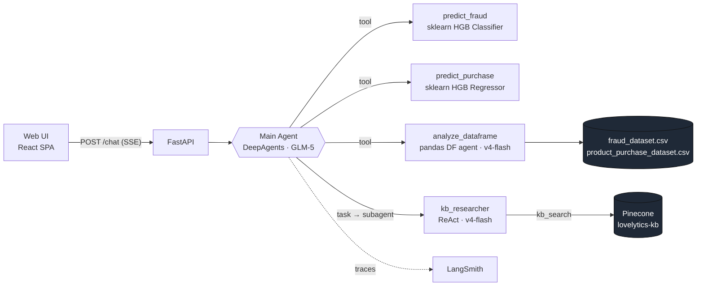
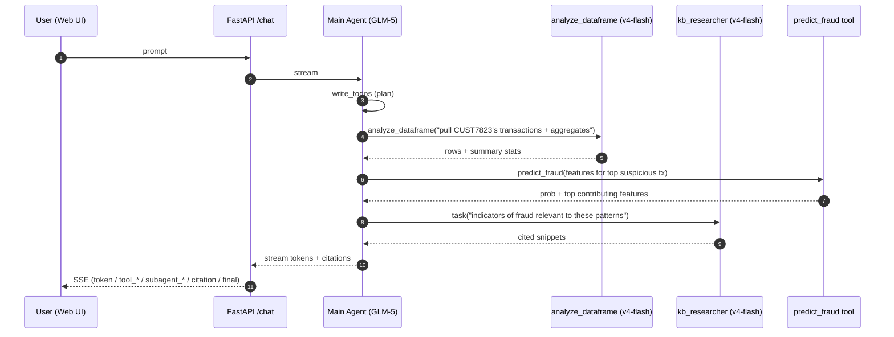
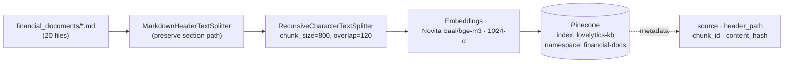

# Financial AI Agent — Lovelytics x Luka Cerrutti

<p align="center">
  
  &nbsp;&nbsp;&nbsp;&nbsp;
  
</p>

> A prototype AI assistant for financial fraud analysts. It understands natural-language questions, queries transaction data, applies fraud / purchase ML models, and retrieves cited knowledge from a financial document base — all behind a single streaming chat endpoint.

This README is the **technical write-up** for the agent. Setup and operational pointers are kept short; the focus is on the architecture, the trade-offs and *why* each piece is there.

---

## 1. TL;DR

- **Main agent**: [DeepAgents](https://docs.langchain.com/oss/python/deepagents) (slimmed down) running `zai-org/glm-5` on Novita's OpenAI-compatible API.
- **One specialised subagent** spawned via the `task` tool: a `kb_researcher` (ReAct over Pinecone). It runs on the cheaper `deepseek/deepseek-v4-flash`.
- **One delegated tool**, `analyze_dataframe`, that wraps `create_pandas_dataframe_agent` (also `deepseek/deepseek-v4-flash`) and answers ad-hoc CSV questions in a single call — kept as a flat tool rather than a subagent because there's no need for the planner to round-trip on dataframe work.
- **Two ML tools** wrapped around scikit-learn `HistGradientBoostingClassifier` (fraud) and `HistGradientBoostingRegressor` (purchase amount), with pydantic-validated inputs.
- **Knowledge base**: 20 markdown docs split with `MarkdownHeaderTextSplitter` + `RecursiveCharacterTextSplitter`, embedded with Novita `baai/bge-m3` (1024-d), upserted to Pinecone serverless.
- **Serving**: FastAPI with a single SSE `/chat` endpoint that streams typed events (`token | tool_start | tool_end | subagent_start | subagent_end | citation | final | error`) so the UI can render the agent's reasoning live.
- **UI**: a small React/TanStack SPA in `web/` (built static for Cloudflare Pages).
- **Observability**: LangSmith ready to plug in via env vars.

---

## 2. Architecture



**Why this shape?** The brief mixes three very different capabilities (structured data analytics, ML inference, document QA). A flat ReAct agent with all tools on the main loop is simpler but loses focus when questions require multi-step research. DeepAgents gives us a planner + the ability to delegate to specialised subagents, each with a tight toolbelt. The main agent never touches Pinecone or the dataframes directly — it *delegates*, which keeps its context lean and its decisions auditable.

---

## 3. Agent flow — a complex query

Example: *"Analyze customer CUST7823's transaction history and assess their fraud risk."*



The order isn't hard-coded; the planner decides. The point is that a single user turn produces a chain of tool/subagent events, all surfaced over SSE so the UI can render the reasoning timeline.

---

## 4. Knowledge base — ingestion pipeline



Re-running ingestion **rebuilds** the namespace (delete + re-upsert) so the index always matches the source files. Triggered either via `make ingest` or `POST /kb/ingest` (API-key gated outside development).

---

## 5. Components

### 5.1 Main agent — DeepAgents, slimmed down

We use `create_deep_agent` with the planner and subagent middleware kept, and the filesystem tools dropped by registering a `HarnessProfile` that lists the FS tool names (`ls`, `read_file`, `write_file`, `edit_file`, `glob`, `grep`, `execute`) in `excluded_tools`. The DeepAgents `FilesystemMiddleware` itself is required scaffolding for the planner — only its *exposed tools* are stripped. The virtual filesystem isn't useful here: none of our tools read or write files at the agent layer.

The system prompt is short and scoped: *you are a fraud-analyst assistant; delegate KB lookups to `kb_researcher`, call `analyze_dataframe` for ad-hoc CSV questions, and use the ML tools for predictions; always cite KB sources by filename and section*.

LLM parameters are tuned conservatively: `temperature=0.0`, `top_p=0.9`. We want deterministic, factual answers, not creative writing.

### 5.2 `analyze_dataframe` tool

A plain `@tool` (`async def analyze_dataframe(question: str) -> str`) that wraps `langchain_experimental.agents.create_pandas_dataframe_agent` with `agent_type="tool-calling"` over both dataframes loaded once at startup. Required `allow_dangerous_code=True` because the inner agent runs a Python REPL on the dataframes — acceptable in a single-tenant prototype on two static CSVs, called out again in §9.

Kept as a tool rather than a subagent: dataframe questions are typically one-shot (run a pandas op, summarise) and don't benefit from the planner round-tripping with a separate agent context. The `DATA_ANALYST_PROMPT` enforces a "reduce before returning" rule (`.value_counts()`, `.head(N≤10)`, `.describe()`, etc.) so the tool never dumps raw rows back into the main agent's context.

Same `temperature=0.0` as the main agent.

### 5.3 `kb_researcher` subagent

Owns the Pinecone retriever via a private `kb_search(query: str, k: int = 5)` tool. The main agent **does not** have direct access to `kb_search`; it must spawn this subagent. This forces multi-hop research patterns where they matter and avoids the main planner doing brittle one-shot retrievals.

Returns a synthesised answer plus a list of citations (`source`, `header_path`, snippet) that propagate back through the SSE stream as `citation` events.

### 5.4 ML tools

| Tool | Model | Input schema | Output schema |
|---|---|---|---|
| `predict_fraud` | `HistGradientBoostingClassifier` inside a `Pipeline` (OneHot for categoricals with `handle_unknown="ignore"`, passthrough numerics) | `FraudFeatures` | `FraudPrediction` = `{probability, label, top_features}` |
| `predict_purchase` | `HistGradientBoostingRegressor` (same pipeline shape) | `PurchaseFeatures` | `PurchasePrediction` = `{predicted_amount, top_features}` |

All four schemas live in `app/ml/schemas.py` and are picked up automatically by LangChain — bad calls fail fast with a structured error returned to the model, no separate "schema introspection" tool needed. Categorical fields with small, stable cardinalities use `Literal` for instant validation feedback; open-ended ones (`country`, `merchant_category`, `preferred_category`) accept any `str` because pinning ~50 country names would be brittle and `OneHotEncoder(handle_unknown="ignore")` handles novel values gracefully at inference.

`top_features` is the top-5 features from `sklearn.inspection.permutation_importance`, precomputed at training time with `n_repeats=10`, scored on the headline metric of each model (ROC-AUC for fraud, R² for purchase), and shipped in `models/metrics.json`. Inference reads it from an `lru_cache` — cheap, deterministic, no SHAP runtime dependency.

### 5.5 FastAPI surface

| Method | Path | Purpose |
|---|---|---|
| `GET` | `/health` | `{status, models_loaded, kb_indexed}` |
| `GET` | `/docs` | Auto-generated OpenAPI UI |
| `POST` | `/chat` | Streams the agent run as SSE |
| `POST` | `/kb/ingest` | Rebuilds the Pinecone namespace from `financial_documents/`. Requires `X-API-Key` header matching `settings.API_KEY` whenever `ENV != "development"` |

`/chat` request:

```json
{ "messages": [{"role": "user", "content": "..."}, ...] }
```

`/chat` SSE event taxonomy:

| event | data |
|---|---|
| `token` | `{ "delta": "..." }` |
| `tool_start` | `{ "name": "...", "args": {...} }` |
| `tool_end` | `{ "name": "...", "result": "..." }` |
| `subagent_start` | `{ "name": "data_analyst" \| "kb_researcher", "task": "..." }` |
| `subagent_end` | `{ "name": "...", "result": "..." }` |
| `citation` | `{ "source": "...", "header_path": "...", "snippet": "..." }` |
| `final` | `{ "content": "..." }` |
| `error` | `{ "message": "...", "type": "..." }` |

Pydantic models for requests/responses live inline in their route module — no `schemas.py` for so little surface area.

The FastAPI app object lives at `app/main.py`, keeping all application code inside the `app/` package. `make api` runs `fastapi dev app/main.py`; the Dockerfile passes the same path to `fastapi run`.

CORS is wired in `app/main.py`. In `ENV=development` all origins are allowed; in production the allow-list comes from `CORS_ALLOW_ORIGINS` (comma-separated env var).

### 5.6 Configuration

A single `pydantic-settings` `Settings` singleton in `app/config.py`. **Operator-facing knobs** (anything that legitimately changes per environment) are required from the OS env (or a `.env` file in development); everything else — model IDs, index names, paths — lives as in-code defaults on the `Settings` class so swapping them is a code change, not a configuration change.

Environment-only variables (the full list — see `.env.example`):

```
ENV=development                 # defaults to "production"; toggles X-API-Key enforcement on /kb/ingest
API_KEY=...                     # required when ENV != "development"; gates /kb/ingest
CORS_ALLOW_ORIGINS=https://app.example.com,https://example.com   # comma-separated; ignored in dev (all origins allowed)
NOVITA_API_KEY=...
PINECONE_API_KEY=...
LANGSMITH_TRACING=true
LANGSMITH_API_KEY=...
LANGSMITH_PROJECT=lovelytics-task
```

In-code defaults (change them in `app/config.py`, not `.env`):

```python
NOVITA_BASE_URL  = "https://api.novita.ai/openai/v1"
EMBEDDING_MODEL  = "baai/bge-m3"          # 1024-d
PINECONE_INDEX   = "lovelytics-kb"
PINECONE_NAMESPACE = "financial-docs"
KB_DIR           = Path("financial_documents")
KB_TOP_K         = 10
DATASETS_DIR     = Path("datasets")
MODELS_DIR       = Path("models")
```

Web (Vite):

```
VITE_API_BASE_URL=http://localhost:8000
```

### 5.7 Async by default

Every code path that performs I/O — model calls, Pinecone queries, embedding requests, the pandas subagent, FastAPI handlers — is written `async`. The convention is consistent end-to-end:

- **Tools** are `async def` even when the underlying work is CPU-bound (e.g. sklearn inference in `predict_fraud` / `predict_purchase`). LangGraph's tool node refuses to call sync `StructuredTool` methods once *any* tool in the set is async; declaring everything async keeps the dispatch path uniform and avoids `NotImplementedError: StructuredTool does not support sync invocation` mismatches.
- **External clients** use the async API where the library exposes both — `PineconeAsyncio` (not `Pinecone`) for index lifecycle and namespace deletes, `asimilarity_search` (not `similarity_search`) for retrieval, `aembed_documents` / `aembed_query` for embeddings, `ainvoke` / `astream_events` on every LangChain runnable.
- **Pragmatic fallback.** When an async API is broken or fights the runtime more than it's worth, sync is acceptable as a last resort — but the choice is documented in a comment so the next reader knows it was deliberate, not lazy.
- **Entry points.** Scripts under `scripts/` are sync `def main()` wrappers around `asyncio.run(...)`; FastAPI routes are `async def`. There are no nested event loops anywhere.

---

## 6. Data & models

### 6.1 Datasets

| File | Rows | Target | Use |
|---|---|---|---|
| `datasets/fraud_dataset.csv` | 100 | `fraud` (binary) | Fraud classifier |
| `datasets/product_purchase_dataset.csv` | 100 | `purchase_amount` (continuous) | Purchase regressor |

### 6.2 Training

Both models share the same recipe: `ColumnTransformer` (OneHotEncoder for categoricals with `handle_unknown="ignore"`, passthrough for numerics — `HistGradientBoosting` handles missing values and scaling natively) feeds a `HistGradientBoosting{Classifier,Regressor}` inside a single `Pipeline`. Fixed `random_state=42` everywhere.

**Why 5-fold cross-validation instead of a single 80/20 holdout.** With only 100 rows, a 20-row test set produces metrics with very high variance — a few unlucky points can swing ROC-AUC by 0.1. 5-fold CV reports mean ± std across 5 different splits, costs nothing at this scale (training takes <1s per fold), and is the honest thing to do given the sample size. Fraud uses `StratifiedKFold` to preserve the 50/50 class balance per fold; purchase uses plain `KFold` because the target is continuous. Both fold once with `shuffle=True`.

**Why these metrics.**
- **Fraud:** `roc_auc` (headline ranking metric), `average_precision` / PR-AUC (more honest than ROC-AUC under class imbalance — kept because real fraud is always imbalanced even though this toy set is 50/50), `f1` and `accuracy` at the 0.5 threshold (interpretable point estimates).
- **Purchase:** `mae` and `rmse` (in dollars, directly interpretable), `r2` (variance explained).

**Why permutation importance with `n_repeats=10`.** Single-shuffle importances are noisy; 10 repeats gives a stable ranking with negligible runtime at this scale. Importance is scored on the same metric as the headline (`roc_auc` for fraud, `r2` for purchase) and computed against the *raw* pipeline input — so each importance value maps cleanly to one agent-facing feature, with no need to aggregate across one-hot-expanded columns. The result is precomputed at training time and stored in `metrics.json`, so inference reads it from cache instead of re-running `permutation_importance` on every request (per AGENTS.md §9).

**Refit on the full data after CV** for the deployed model — CV is for evaluation only.

| Model | Headline metric | Other reported |
|---|---|---|
| Fraud classifier | ROC-AUC | PR-AUC, F1, accuracy |
| Purchase regressor | R² | MAE, RMSE |

The actual numbers live in `models/metrics.json` (regenerated by `make train`). With 100 rows they're illustrative, not production-grade — see §9.

### 6.3 Artifacts

`models/fraud.joblib`, `models/purchase.joblib` and `models/metrics.json` are **committed**. They're tiny (tens of KB) and let the API boot without a training step. A `pre-commit` hook re-trains them whenever the CSVs or training code change, so they never go stale. Committing artifacts to git is a prototype shortcut, not a production pattern — see §9.

---

## 7. Running locally

Everything is wrapped in the `Makefile`. Common entry points:

```bash
make install         # uv sync + bun install (web)
make train           # train both ML models, write models/*.joblib + metrics.json
make ingest          # rebuild the Pinecone KB namespace
make chat            # CLI smoke test: uv run python -m scripts.chat [--stream] "..."
make api             # uv run fastapi dev (http://localhost:8000)
make web             # bun run dev   (http://localhost:3000)
make web-build       # static SPA build → web/dist (Cloudflare Pages ready)
make test            # pytest
make check           # ruff + basedpyright
make pre-commit      # install + autoupdate pre-commit hooks
```

First run:

```bash
cp .env.example .env   # fill in NOVITA_API_KEY, PINECONE_API_KEY
make install
make train
make ingest
make api
```

The Dockerfile mirrors this: `uv sync` → copy code → run training during the build step → `fastapi run` at port 8080.

---

## 8. Observability

LangSmith is wired through the env vars in `.env.example`. Set `LANGSMITH_TRACING=true` and a project name, and every `/chat` run shows up as a trace including subagent spans and tool calls. No extra code required.

---

## 9. Trade-offs & limitations

- **Tiny dataset (100 rows).** Reported metrics are illustrative. Real evaluation needs a meaningful test set and cross-validation.
- **Pandas REPL subagent uses `allow_dangerous_code=True`.** Acceptable for a single-tenant prototype on two static CSVs. Not acceptable in production.
- **Joblib artifacts committed to git.** Convenient for a tech test. In production they belong in an artifact registry (MLflow / Unity Catalog Model Registry / S3) with versioning and lineage.
- **No auth on `/chat`.** Only `/kb/ingest` is gated. A real deployment needs auth, rate limiting and per-user quotas.
- **Stateless `/chat`.** No DB, no cache, conversation history is client-managed. Matches the brief but won't scale to multi-user persistent sessions.
- **No guardrails on inputs/outputs.** A real assistant would need PII redaction, prompt-injection defence and output safety.
- **Pinecone serverless free tier** has cold-start latency on the first query after idle. Fine for a demo.
- **Models hard-coded to Novita.** Provider abstraction would help; today it's one env-var swap.

---

## 10. What I'd improve with more time

- **Better boosters**: try XGBoost / LightGBM with proper hyperparameter search; HistGradientBoosting is a solid baseline but rarely state-of-the-art on tabular fraud data.
- **DuckDB-over-CSV tool** instead of a pandas REPL subagent: deterministic SQL, no arbitrary code execution, much smaller blast radius.
- **Real eval set + LangSmith evaluators** with golden Q/A pairs for each query category (data analysis, prediction, knowledge, complex).
- **MLflow / Unity Catalog Model Registry** for model artifacts, replacing the committed `.joblib` files.
- **Databricks-native variant**: Delta tables for the transaction data, Vector Search instead of Pinecone, Model Serving for the ML tools, Mosaic AI Agent Framework as the orchestration layer.
- **Auth + rate limiting** (e.g. Cloudflare Access in front of the API), persistent threads with a small Postgres store.
- **Guardrails**: PII filter on the SSE pipe, prompt-injection defence on the KB researcher, output safety classifier.
- **Streaming the planner's `write_todos` output** to the UI as a checklist, so the user sees the agent's plan evolve.
- **Caching**: embed cache for the KB ingestion path, response cache for repeated KB queries.

---

## 11. Repo layout

Items marked *(planned)* are expected by the architecture but not yet implemented in the current commit.

```
app/
  __init__.py
  config.py              # pydantic-settings singleton + .env loader
  llm.py                 # main_chat_model() / subagent_chat_model() factories
  main.py                # FastAPI app + CORS + router includes
  sse.py                 # astream_events → typed SSE frame mapper
  api/
    __init__.py
    deps.py              # require_api_key dependency
    health.py            # GET /health
    chat.py              # POST /chat (SSE)
    kb.py                # POST /kb/ingest (API-key gated outside dev)
  agent/
    __init__.py
    builder.py           # build_agent() — registers FS-exclusion HarnessProfile
    prompts.py           # MAIN_PROMPT, KB_RESEARCHER_PROMPT, DATA_ANALYST_PROMPT
    subagents.py         # kb_researcher_subagent() — SubAgent TypedDict factory
    tools/
      __init__.py
      ml.py              # predict_fraud, predict_purchase (async @tool)
      kb.py              # kb_search (used ONLY inside kb_researcher subagent)
      dataframe.py       # analyze_dataframe — pandas DF agent wrapper
  retrieval/
    __init__.py
    splitter.py          # Markdown → header-aware chunks
    embeddings.py        # Novita bge-m3 via OpenAIEmbeddings (chunk_size=64)
    vectorstore.py       # async ensure_index + per-call PineconeVectorStore
    ingest.py            # rebuild_kb() — wipe + re-upsert
    retrieve.py          # search() — basis for kb_search tool
  ml/
    __init__.py
    schemas.py           # FraudFeatures / PurchaseFeatures + prediction models
    preprocess.py        # build_preprocessor() — ColumnTransformer factory
    train_fraud.py       # CV + permutation importance, returns (Pipeline, metrics)
    train_purchase.py
    inference.py         # cached predict_fraud / predict_purchase
scripts/
  __init__.py
  ingest_kb.py
  train_all.py
  chat.py                # CLI smoke test: --stream / --verbose
tests/                   # flat, pytest
  test_splitter.py
  test_ml.py
  test_agent.py
models/                  # fraud.joblib, purchase.joblib, metrics.json (committed)
datasets/                # fraud + purchase CSVs
financial_documents/     # 20 markdown docs
web/                     # React/TanStack SPA (Vite, SPA-only)
  src/
    main.tsx             # RouterProvider entry
    styles.css           # dark palette, #c47fd5 accent, .prose-chat, animations
    routeTree.gen.ts     # generated by @tanstack/router-plugin
    lib/
      api.ts             # streamChat() SSE consumer + typed AgentEvent union
      utils.ts           # cn() helper
    routes/
      __root.tsx         # minimal <Outlet/>
      index.tsx          # chat UI: header, timeline, citations, composer
  index.html
  vite.config.ts
  .env.example           # VITE_API_BASE_URL
assets/                  # logos
Makefile
Dockerfile
pyproject.toml
.pre-commit-config.yaml
```
